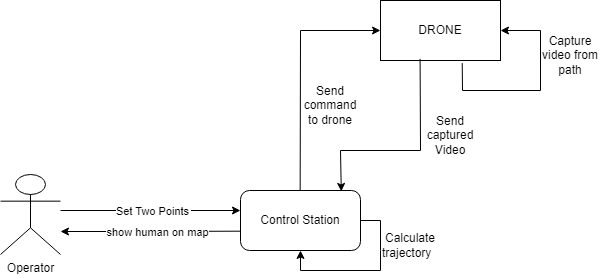

# Surveillance Drone Project

The **Surveillance Drone Project** is a comprehensive autonomous drone system designed for surveillance and person detection missions. It integrates a user-friendly UI, advanced mission planning, and real-time computer vision to control a DJI Tello drone for scanning designated areas.



## Core Features

*   **Interactive Mission Planner**: A robust PyQt6-based user interface that allows users to define mission areas, visualize drone paths, and monitor status.
*   **Autonomous Navigation**: C++ based pathfinding algorithms that generate optimal flight paths for the drone to cover grid-based areas.
*   **Real-Time Object Detection**: Integrated YOLOv8 model (`person-detection` module) to detect people in the drone's video feed and pinpoint their locations on the map.
*   **Live Video Streaming**: Low-latency video feed using FFmpeg and OpenCV to display the drone's camera view directly in the application.
*   **Drone Telemetry & Control**: Direct communication with the DJI Tello drone via a custom driver (`tello_driver.py`) to handle takeoff, landing, movement, and status updates (battery, WiFi).
*   **Safety & Permissions**: Built-in safety checks and a permission system for critical maneuvers like rotation.

## System Architecture

The project is organized into several key modules:

*   **`UI/`**: The heart of the application. `main.py` launches the PyQt6 interface, handling user interactions, map rendering, and coordination between different services.
*   **`missionPlanner/`**: A C++ backend responsible for path planning logic. It processes map data (SVG) and generates flight commands.
*   **`person-detection/`**: A Python-based service running YOLOv8 to analyze video frames for human detection. It communicates with the UI via ZMQ.
*   **`tello_driver.py`**: A dedicated script that interfaces with the Tello drone SDK, executing commands received from the mission planner or manual overrides.

## Prerequisites

Before running the project, ensure you have the following installed:

*   **Linux OS** (Tested on Ubuntu/Debian based systems)
*   **Python 3.8+**
*   **C++ Compiler** (GCC/G++)
*   **FFmpeg**
*   **Node.js** (for `svgpp` dependency if customized)

## Installation

1.  **Clone the Repository**
    ```bash
    git clone <repository_url>
    cd surveillance_drone_project
    ```

2.  **Install Python Dependencies**
    Navigate to the project root and install requirements for the UI and Tello driver:
    ```bash
    pip install -r requirements.txt
    ```
    *Note: If a `requirements.txt` is missing, key packages include `PyQt6`, `opencv-python`, `djitellopy`, `pyzmq`, `ultralytics`.*

3.  **Build C++ Mission Planner**
    Navigate to the `missionPlanner` directory and build the executable:
    ```bash
    cd missionPlanner
    make
    ```

4.  **Setup Person Detection**
    Ensure the YOLOv8 model weights (`yolov8s.pt`) are available in the `person-detection` directory.

## Usage

1.  **Connect to Tello Drone**
    Power on your Tello drone and connect your computer to its WiFi network.

2.  **Launch the Application**
    Run the main UI script from the project root:
    ```bash
    python3 UI/main.py
    ```

3.  **Plan a Mission**
    *   Use the map interface to set a flight boundary or grid.
    *   Click "Generate Path" to calculate the drone's route.

4.  **Start Surveillance**
    *   Click "Start Mission" to initiate the drone's autonomous flight.
    *   Monitor the "Live Video" feed for detections.
    *   Detected persons will appear as pinpoints on the map.

## Troubleshooting

*   **Video Lag**: Ensure FFmpeg is correctly installed and the network connection to the drone is stable.
*   **Connection Issues**: Verify that no other process is using the Tello's UDP ports (8889, 11111).
*   **Path Finding Errors**: Check if the `mission_planner` executable is compiled and accessible by the UI.
